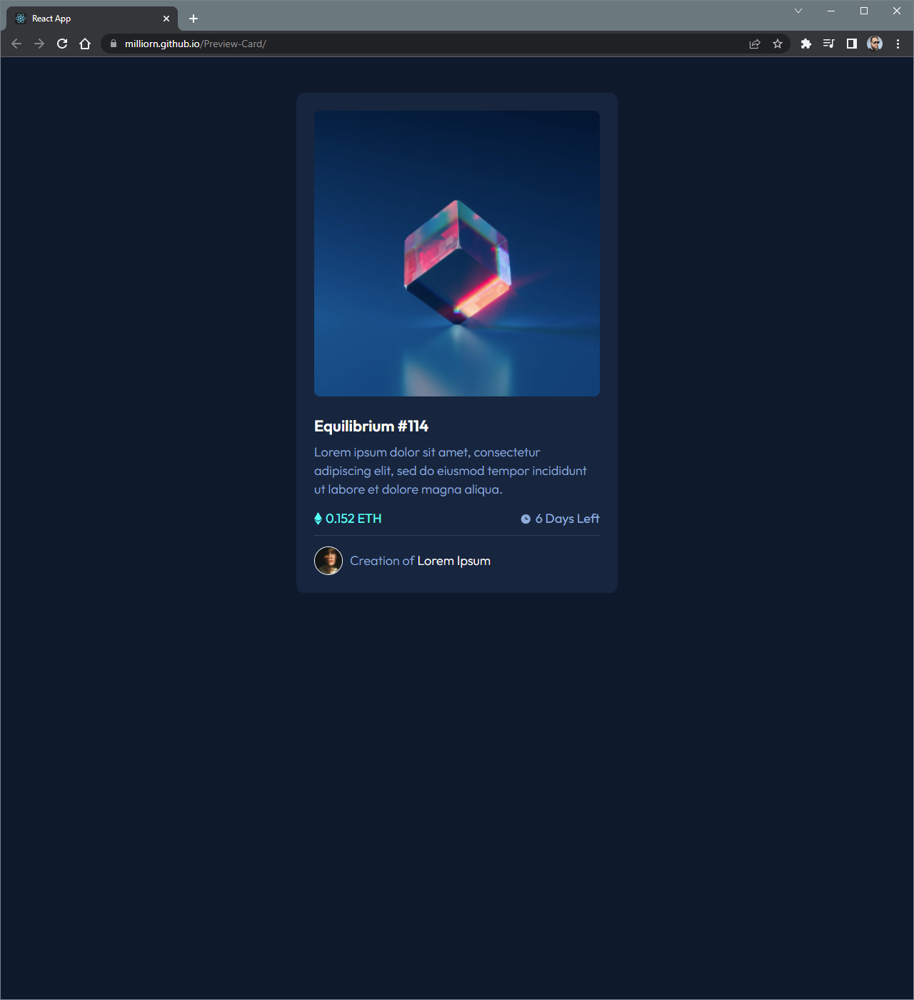

# Preview Card

This repository contains the code for a responsive preview card component. The preview card is designed to showcase a product, service, or any other content with a visually appealing layout. It includes an image, title, description, and customizable call-to-action button.

## Technologies Used

The preview card is built using the following technologies:

- HTML5: Provides the structure and layout of the card.
- CSS3: Used for styling the card and creating responsive design.
- JavaScript: Enhances the interactivity of the card and handles dynamic data.

## Links

This project was bootstrapped with [Create React App](https://github.com/facebook/create-react-app).

Adding TypeScript -> <https://create-react-app.dev/docs/adding-typescript/>

gh-pages -> <https://www.npmjs.com/package/gh-pages>

Install Tailwind CSS with Create React App -> <https://tailwindcss.com/docs/guides/create-react-app>
