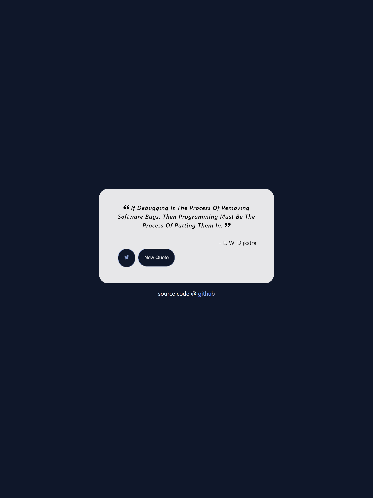

# Random Quote

Random Quote Generator is a web application that displays random quotes to users. It is designed to provide users with inspirational, motivational, or thought-provoking quotes at the click of a button. The quotes are fetched from a predefined list, and users can easily get a new quote by clicking the "New Quote" button.

The application is built using React and easy to use. It serves as a fun and simple way to brighten someone's day or provide them with some words of wisdom.

## Features

- Random Quotes: Displays a new random quote each time the "New Quote" button is clicked.
- Inspirational Messages: Provides users with inspirational and motivational quotes to uplift their spirits.
- Simple User Interface: Easy-to-use interface with a minimalist design.

